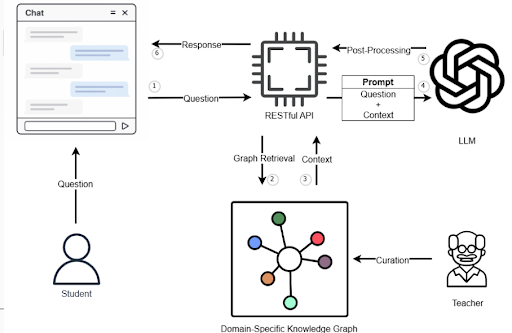
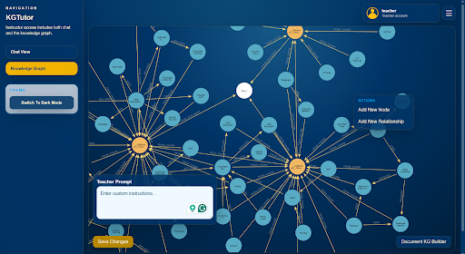
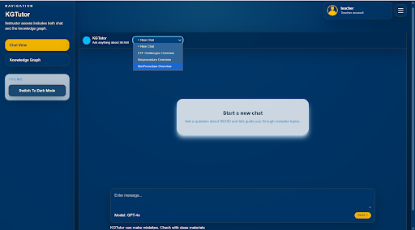

# A chatbot teachers can recommend to students.

## System Overview
---



There are two main interfaces:
1. A knowledge graph curation interface where teachers can upload documents and edit the knowledge graph.



2. A chat interface where students can interact with the LLM tutor, which directly utilizes the knowledge graph.



## Set up
---
Clone the repository locally or on a desired server.
```
git clone https://github.com/Will-78/C-LASS.git
cd C-LASS
```

## Deployment steps
---
You can start the stack up using
```
docker-compose up --build
```
or
```
docker-compose up --build -d
```
from the main directory of the repository. 

## Usage guide
---
Once the containers are running, access the application at:
```
http://localhost/
```
The domain name and server features can be edited through the Caddyfile.

## Contributors
---
<a href="https://github.com/Will-78/C-LASS/graphs/contributors">
  
</a>

## License
---
This project is licensed under the [Apache-2.0 License](./LICENSE).
